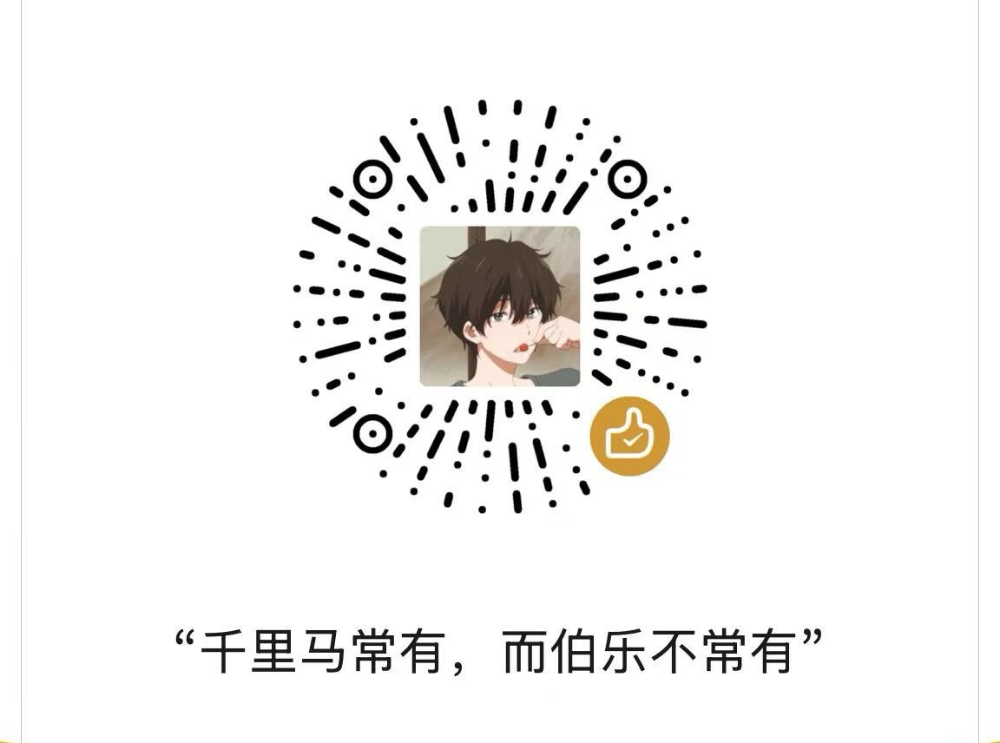

# 提示词

帮我优化当前页面，让其页面样式变得更加酷炫，交互体验更好。


1）添加返回首页，跳转到 https://houbb.github.io

2) 添加统一的 footer

```html
    .footer {
			margin-top: 60px;
			text-align: center;
			color: #fff;
			display: flex;
			flex-direction: column;
			align-items: center;
			justify-content: center;
			gap: 18px;
		}
		.footer-text {
			text-align: center;
			font-size: 1.18rem;
			margin-bottom: 10px;
		}
		.footer-img {
			display: flex;
			flex-direction: row;
			align-items: center;
			justify-content: center;
			gap: 32px;
		}
		.footer-img img:first-child {
			width: 220px;
			max-width: 260px;
			min-width: 120px;
			border-radius: 12px;
			box-shadow: 0 2px 16px #222;
		}
		.footer-img img:last-child {
			width: 180px;
			max-width: 220px;
			min-width: 100px;
			border-radius: 12px;
			box-shadow: 0 2px 16px #222;
		}
        
   <div class="footer">
	  <div class="footer-text">技术改变世界，思考引领未来</div>
	  <div class="footer-img">
		
		
	  </div>
   </div>
```


